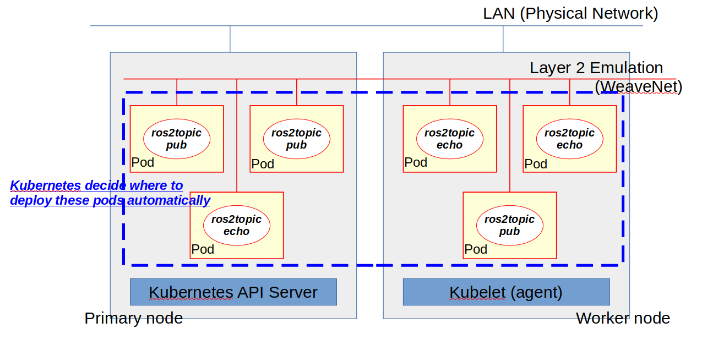

# ROS 2 Deployment Demonstration

This section provides several example deployments with ROS 2, starting with basic deployment to complicated configuration with diagrams.

## ROS Rolling Demonstration

***<span style="color: red"> Please Use WeaveNet CNI Plugin </span>***

For ROS Rolling, we can only use any CNI implementation Weave but Flannel/Cilium, since ROS 2 uses DDS underneath as RMW implementation for transport framework.
DDS uses multicast (depends on DDS implementation), but some CNI implementation cannot support multicast packets, in that case ROS 2 discovery process cannot work as expected.

If we can be sure that RMW implementation does not rely on UDP multicast, we can of course use other CNI plugins.
Most likely this case applied to use case ofr discovery server and so on, using TCP/UDP unicast packets.

### ROS 2 Simple Distributed System

This example deploys ROS 2 application pods to any available nodes in the cluster, since we do not set the `nodeselector`, Kubernetes decides where to deploy the application container based on statistics from the system.
Kubernetes by default will not deploy any application pods to control-plane(master) node, this is because Kubernetes tries to conserve the resource on control-plane to manage the all fleet in the cluster and query from user.
In this deployment description, it uses `tolerations` for the application deployment so that Kubernetes can deploy these application containers even to master node.
That is said that Kubernetes is responsible to keep the deployment even if anything happens to container crashes, it will be re-instantiated by Kubernetes.
This is actually controlled by `restartPolicy` description in the yaml file.

**This example shows that use case that, we do not even need to know where to deploy but application should be available somewhere in the ROS 2 system.**

Using WeaveNet can provide layer 2 emulation, that means all containers are connected via virtual physical local area network even with multicast capability.
So all discovery protocol just works out of the box like physical network.

**see deployment description [ROS 2 Simple Distributed System](./../yaml/ros2-sample.yaml)**



- Start deployment and check availability.

```bash
> kubectl apply -f ros2-sample.yaml
deployment.apps/ros2-talker-1 created
deployment.apps/ros2-talker-2 created
deployment.apps/ros2-talker-3 created
deployment.apps/ros2-listener-1 created
deployment.apps/ros2-listener-2 created
deployment.apps/ros2-listener-3 created

> kubectl get pods -o wide
NAME                               READY   STATUS    RESTARTS      AGE   IP          NODE                                    NOMINATED NODE   READINESS GATES
ros2-listener-1-5c87cc854d-c4q78   1/1     Running   0             15m   10.32.0.4   tomoyafujita-hp-compaq-elite-8300-sff   <none>           <none>
ros2-listener-2-7c8f99f79-lg8dp    1/1     Running   1 (15m ago)   15m   10.44.0.5   ubuntu                                  <none>           <none>
ros2-listener-3-5778bb66c4-j9pp8   1/1     Running   0             15m   10.32.0.5   tomoyafujita-hp-compaq-elite-8300-sff   <none>           <none>
ros2-talker-1-54f5fb9dcd-2dlv6     1/1     Running   0             15m   10.44.0.4   ubuntu                                  <none>           <none>
ros2-talker-2-774d9b5846-bwm2s     1/1     Running   0             15m   10.44.0.3   ubuntu                                  <none>           <none>
ros2-talker-3-67c88d57d-z52l4      1/1     Running   0             15m   10.44.0.6   ubuntu                                  <none>           <none>
```

- Jump in one of container to see the activity.

```bash
> kubectl exec --stdin --tty ros2-talker-1-54f5fb9dcd-2dlv6 -- /bin/bash

root@ros2-talker-1-54f5fb9dcd-2dlv6:/# source /opt/ros/rolling/setup.bash

root@ros2-talker-1-54f5fb9dcd-2dlv6:/# ros2 topic list
/chatter1
/chatter2
/chatter3
/parameter_events
/rosout
root@ros2-talker-1-54f5fb9dcd-2dlv6:/# ros2 topic list -v
Published topics:
 * /chatter1 [std_msgs/msg/String] 1 publisher
 * /chatter2 [std_msgs/msg/String] 1 publisher
 * /chatter3 [std_msgs/msg/String] 1 publisher
 * /parameter_events [rcl_interfaces/msg/ParameterEvent] 10 publishers
 * /rosout [rcl_interfaces/msg/Log] 10 publishers

Subscribed topics:
 * /chatter1 [std_msgs/msg/String] 1 subscriber
 * /chatter2 [std_msgs/msg/String] 1 subscriber
 * /chatter3 [std_msgs/msg/String] 1 subscriber

root@ros2-talker-1-54f5fb9dcd-2dlv6:/# ros2 topic echo /chatter1 std_msgs/String
data: Hello, I am talker-1
---
data: Hello, I am talker-1
---
^Croot@ros2-talker-1-54f5fb9dcd-2dlv6:/# ros2 topic echo /chatter2 std_msgs/String
data: Hello, I am talker-2
---
data: Hello, I am talker-2
---
^Croot@ros2-talker-1-54f5fb9dcd-2dlv6:/# ros2 topic echo /chatter3 std_msgs/String
data: Hello, I am talker-3
---
data: Hello, I am talker-3
---
...
```

### ROS 2 Localhost Only

This sample description starts deployment multiple application pods for each cluster node.
Application containers in each pod will only start communication in localhost only with `ROS_LOCALHOST_ONLY=1` environmental variable which is bound to application container runtime.

The following diagram gives you an good example and overview what is going on this deployment.

Taking advantage virtual network interface from CNI plugin, we can even have multiple localhost network in single cluster node.
This is useful to multiple users in single cluster system, it just appears to be for users to have dedicated network interfaces so that it will not affect any other ROS 2 communication.

**see deployment description [ROS 2 Localhost Only](./../yaml/ros2-localhost.yaml)**


-  Start deployment and check availability

```bash
> kubectl apply -f ros2-localhost.yaml
daemonset.apps/ros2-deamonset-1 created
daemonset.apps/ros2-deamonset-2 created

> kubectl get pods -o wide
NAME                     READY   STATUS    RESTARTS   AGE    IP           NODE                                    NOMINATED NODE   READINESS GATES
ros2-deamonset-1-68bt2   2/2     Running   0          5m2s   10.44.0.3    ubuntu                                  <none>           <none>
ros2-deamonset-1-zp2lq   2/2     Running   0          5m2s   10.32.0.11   tomoyafujita-hp-compaq-elite-8300-sff   <none>           <none>
ros2-deamonset-2-lgbnp   2/2     Running   0          5m     10.44.0.7    ubuntu                                  <none>           <none>
ros2-deamonset-2-mf69r   2/2     Running   0          5m2s   10.32.0.12   tomoyafujita-hp-compaq-elite-8300-sff   <none>           <none>
```

- Check each pod to see if localhost communication actually takes place.

```bash
root@ros2-talker-1-54f5fb9dcd-2dlv6:/# command terminated with exit code 137
> kubectl exec --stdin --tty ros2-deamonset-1-68bt2 -- /bin/bash
Defaulted container "ros2-talker-1" out of: ros2-talker-1, ros2-listener-1
root@ros2-deamonset-1-68bt2:/# echo $ROS_LOCALHOST_ONLY
1
root@ros2-deamonset-1-68bt2:/# source /opt/ros/rolling/setup.bash
root@ros2-deamonset-1-68bt2:/# ros2 node list
/listener
/talker
root@ros2-deamonset-1-68bt2:/# ros2 topic list
/chatter
/parameter_events
/rosout
```

### ROS 2 Logical Partition / Multiple RMW Implementation

This section it will deploy the ROS 2 application containers with host network interface.
And taking advantage of Kubernetes `ConfigMap` (Shared virtual storage) to bind ROS 2 specific environmental variable via initializing container runtime.
After `ConfigMap` is created, in the yaml description, we can use those `key-value` content as environmental variables for ROS 2 containers, here it uses `ROS_DOMAIN_ID` and `RMW_IMPLEMENTATION` to have logical partition and different RMW implementation support.

The advantage of this example is to isolate configuration data and runtime container completely, so that we can bind any configuration data to any container runtime when starting the deployment.

**see deployment description [ROS 2 Domain Partition and ConfigMap](./../yaml/ros2-domain-configmap.yaml)**


- Add labels

In this example, we control fleet deployment based on nodetype labels.
So we need to add labels for each cluster node as following.

```bash
> kubectl label nodes tomoyafujita-hp-compaq-elite-8300-sff nodetype=edgeserver
> kubectl label nodes ubuntu nodetype=edgedevice

> kubectl get nodes --show-labels
NAME                                    STATUS   ROLES           AGE   VERSION   LABELS
tomoyafujita-hp-compaq-elite-8300-sff   Ready    control-plane   12m   v1.25.5   beta.kubernetes.io/arch=amd64,beta.kubernetes.io/os=linux,kubernetes.io/arch=amd64,kubernetes.io/hostname=tomoyafujita-hp-compaq-elite-8300-sff,kubernetes.io/os=linux,node-role.kubernetes.io/control-plane=,node.kubernetes.io/exclude-from-external-load-balancers=,nodetype=edgeserver
ubuntu                                  Ready    <none>          12m   v1.25.5   beta.kubernetes.io/arch=arm64,beta.kubernetes.io/os=linux,kubernetes.io/arch=arm64,kubernetes.io/hostname=ubuntu,kubernetes.io/os=linux,nodetype=edgedevice
```

- Create `ConfigMap` in cluster system

```bash
> kubectl apply -f ros2-config.yaml 
configmap/fastdds-config-domain-5 created
configmap/fastdds-config-domain-10 created
configmap/cyclonedds-config created
configmap/connext-config created

> kubectl get configmap
NAME                       DATA   AGE
connext-config             2      6s
cyclonedds-config          2      6s
fastdds-config-domain-10   2      6s
fastdds-config-domain-5    2      6s
kube-root-ca.crt           1      6h6m
```

- Start application pods

Now `ConfigMap` is ready to bind to container runtime as shared storage, we can start the application containers to bind those configuration data as environment variable as we like.

```bash
> kubectl apply -f ros2-domain-configmap.yaml
pod/ros2-fastdds-talker-id5 created
pod/ros2-fastdds-listener-id5 created
pod/ros2-fastdds-talker-id10 created
pod/ros2-fastdds-listener-id10 created

> kubectl get pods -o wide
NAME                         READY   STATUS    RESTARTS      AGE   IP              NODE                                    NOMINATED NODE   READINESS GATES
ros2-fastdds-listener-id10   1/1     Running   2 (14s ago)   19s   192.168.1.248   tomoyafujita-hp-compaq-elite-8300-sff   <none>           <none>
ros2-fastdds-listener-id5    1/1     Running   0             19s   192.168.1.79    ubuntu                                  <none>           <none>
ros2-fastdds-talker-id10     1/1     Running   0             19s   192.168.1.79    ubuntu                                  <none>           <none>
ros2-fastdds-talker-id5      1/1     Running   0             19s   192.168.1.248   tomoyafujita-hp-compaq-elite-8300-sff   <none>           <none>
```

Now we can check if those containers running as expected,

```bash
> kubectl logs ros2-fastdds-listener-id5 | head
data: Hello, I am in the room 5
---
data: Hello, I am in the room 5
---
data: Hello, I am in the room 5
---
data: Hello, I am in the room 5
---
data: Hello, I am in the room 5
---

> kubectl logs ros2-fastdds-listener-id10 | head
data: Hello, I am in the room 10
---
data: Hello, I am in the room 10
---
data: Hello, I am in the room 10
---
data: Hello, I am in the room 10
---
data: Hello, I am in the room 10
---
```

- Using docker container to see the ROS 2 communication

Since all containers bound to host network interface, we can see the ROS 2 communication via host network interface.
We can use docker container to peek ROS 2 activity as following.

```bash
> docker run -it --privileged --network host --name rolling-docker  tomoyafujita/ros:rolling

> export ROS_DOMAIN_ID=5
> export RMW_IMPLEMENTATION=rmw_fastrtps_cpp
> source /opt/ros/rolling/setup.bash 
> ros2 topic list
/fastdds_chatter_5
/parameter_events
/rosout
```