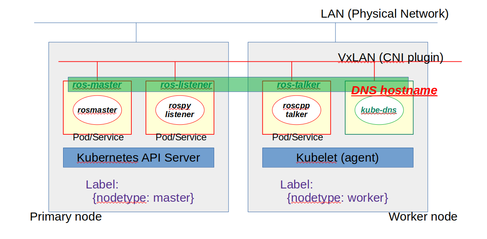

# ROS Deployment Demonstration

This section provides several example deployments, starting with basic deployment to complicated configuration with diagrams.

## ROS Noetic Demonstration

For ROS Noetic, we can use any CNI implementation (Flannel/Weave/Cilium).
This is because that ROS Noetic network is based on TCP/UDP IP network w/o multicast.

### ROS DaemonSet Deployment with CNI

This example deploys all ROS 1 application containers for each cluster node.
That is said rosmaster(roscore) will be starting on each cluster node and other ROS application container will be connecting each other in the localhost system as following.
We can even jump in any cotnainers running in Kubernetes Pods in the cluster to see actually ROS application running and communicating each other.

**see deployment description [ROS DaemonSet Deployment](./../yaml/ros1-daemonset.yaml)**


```bash
### Start deployment described above
root@tomoyafujita-HP-Compaq-Elite-8300-SFF:~/ros_k8s# kubectl apply -f ./yaml/ros1-daemonset.yaml

### Check if deployment running as expected
root@tomoyafujita-HP-Compaq-Elite-8300-SFF:~# kubectl get pods -o wide
NAME                   READY   STATUS    RESTARTS   AGE   IP          NODE                                    NOMINATED NODE   READINESS GATES
ros1-deamonset-67wdh   3/3     Running   0          14m   10.36.0.0   ubuntu                                  <none>           <none>
ros1-deamonset-6zcj8   3/3     Running   0          14m   10.32.0.6   tomoyafujita-hp-compaq-elite-8300-sff   <none>           <none>

### Jump in containers via kubernetes and play
root@tomoyafujita-HP-Compaq-Elite-8300-SFF:~# echo $(kubectl get pods ros1-deamonset-67wdh -o jsonpath='{.spec.containers[*].name}')
ros1-master ros1-talker ros1-listener

root@tomoyafujita-HP-Compaq-Elite-8300-SFF:~# kubectl exec --stdin --tty ros1-deamonset-67wdh --container ros1-master -- /bin/bash
root@ros1-deamonset-67wdh:/# source /opt/ros/noetic/setup.bash 
root@ros1-deamonset-67wdh:/# rosnode list
/rosout
/rostopic_1_1675410564546
/rostopic_1_1675410618399
root@ros1-deamonset-67wdh:/# rostopic list
/chatter
/rosout
/rosout_agg
root@ros1-deamonset-67wdh:/# rostopic echo chatter
data: "Hello, world"
---
data: "Hello, world"
---
data: "Hello, world"
---
...

### Exit from container
root@ros1-deamonset-67wdh:/# exit
exit

### Stop deployment described above
root@tomoyafujita-HP-Compaq-Elite-8300-SFF:~/ros_k8s# kubectl delete -f ./yaml/ros1-daemonset.yaml
```

### ROS Multi-Node Deployment with CNI

This example deploys distributed system with ROS, application containers will be deployed corresponding or targeted cluster node.
In this case, rosmaster will be running on one of the cluster node, and other ROS application container will be connecting to that rosmaster as distributed application.

Accessing rosmaster requires ROS nodes to know the rosmaster IP address to participate to ROS network.
Most likely user sets the environmental variable before starting the application, but problem here is we do not know what IP address is assigned to rosmater container from kubernetes until it deploys application.
Against this problem, it takes advantage of `Headless Service` so that application pods can DNS the hostname based on that service name, whose backend is corresponding application pods.

**see deployment description [ROS Multiple Node Deployment](./../yaml/ros1-multinode.yaml)**



- Add labeling to cluster nodes.

To manage the fleet, here it adds the lable to each node, which also used in the above yaml file.

```bash
### Show labels
root@tomoyafujita-HP-Compaq-Elite-8300-SFF:~# kubectl get nodes --show-labels
NAME                                    STATUS   ROLES           AGE    VERSION   LABELS
tomoyafujita-hp-compaq-elite-8300-sff   Ready    control-plane   118m   v1.25.5   beta.kubernetes.io/arch=amd64,beta.kubernetes.io/os=linux,kubernetes.io/arch=amd64,kubernetes.io/hostname=tomoyafujita-hp-compaq-elite-8300-sff,kubernetes.io/os=linux,node-role.kubernetes.io/control-plane=,node.kubernetes.io/exclude-from-external-load-balancers=
ubuntu                                  Ready    <none>          116m   v1.25.5   beta.kubernetes.io/arch=arm64,beta.kubernetes.io/os=linux,kubernetes.io/arch=arm64,kubernetes.io/hostname=ubuntu,kubernetes.io/os=linux

### Add labels
root@tomoyafujita-HP-Compaq-Elite-8300-SFF:~# kubectl label nodes tomoyafujita-hp-compaq-elite-8300-sff nodetype=master
root@tomoyafujita-HP-Compaq-Elite-8300-SFF:~# kubectl label nodes ubuntu nodetype=worker

### Check labels
root@tomoyafujita-HP-Compaq-Elite-8300-SFF:~# kubectl get nodes --show-labels
NAME                                    STATUS   ROLES           AGE    VERSION   LABELS
tomoyafujita-hp-compaq-elite-8300-sff   Ready    control-plane   126m   v1.25.5   beta.kubernetes.io/arch=amd64,beta.kubernetes.io/os=linux,kubernetes.io/arch=amd64,kubernetes.io/hostname=tomoyafujita-hp-compaq-elite-8300-sff,kubernetes.io/os=linux,node-role.kubernetes.io/control-plane=,node.kubernetes.io/exclude-from-external-load-balancers=,nodetype=master
ubuntu                                  Ready    <none>          125m   v1.25.5   beta.kubernetes.io/arch=arm64,beta.kubernetes.io/os=linux,kubernetes.io/arch=arm64,kubernetes.io/hostname=ubuntu,kubernetes.io/os=linux,nodetype=worker
```

- ROS 1 Deployment and Check

```bash
### Start deployment
root@tomoyafujita-HP-Compaq-Elite-8300-SFF:~/ros_k8s# kubectl apply -f ./yaml/ros1-multinode.yaml
deployment.apps/roscore-deployment created
service/rosmaster created
deployment.apps/talker-deployment created
service/ros-talker created
deployment.apps/listener-deployment created
service/ros-listener created

### Check service and pods are running
root@tomoyafujita-HP-Compaq-Elite-8300-SFF:~# kubectl get pods -o wide
NAME                                   READY   STATUS    RESTARTS   AGE   IP          NODE                                    NOMINATED NODE   READINESS GATES
listener-deployment-5db88c77cf-79plx   1/1     Running   0          29m   10.32.0.5   tomoyafujita-hp-compaq-elite-8300-sff   <none>           <none>
roscore-deployment-5564978d47-bg4sj    1/1     Running   0          29m   10.32.0.4   tomoyafujita-hp-compaq-elite-8300-sff   <none>           <none>
talker-deployment-b468d7b5-2tf7k       1/1     Running   0          29m   10.44.0.1   ubuntu                                  <none>           <none>

root@tomoyafujita-HP-Compaq-Elite-8300-SFF:~# kubectl get services -o wide
NAME           TYPE        CLUSTER-IP   EXTERNAL-IP   PORT(S)   AGE    SELECTOR
kubernetes     ClusterIP   10.96.0.1    <none>        443/TCP   132m   <none>
ros-listener   ClusterIP   None         <none>        <none>    29m    node=listener
ros-talker     ClusterIP   None         <none>        <none>    29m    node=talker
rosmaster      ClusterIP   None         <none>        <none>    29m    node=roscore

### Check logs for each container
root@tomoyafujita-HP-Compaq-Elite-8300-SFF:~# kubectl logs listener-deployment-5db88c77cf-79plx
[INFO] [1675841806.376591]: /listener_1_1675840013908I heard hello world 17918
[INFO] [1675841806.476425]: /listener_1_1675840013908I heard hello world 17919
[INFO] [1675841806.576383]: /listener_1_1675840013908I heard hello world 17920
[INFO] [1675841806.676507]: /listener_1_1675840013908I heard hello world 17921
[INFO] [1675841806.776493]: /listener_1_1675840013908I heard hello world 17922

root@tomoyafujita-HP-Compaq-Elite-8300-SFF:~# kubectl logs talker-deployment-b468d7b5-2tf7k
[ INFO] [1675841845.265373581]: hello world 18307
[ INFO] [1675841845.365361230]: hello world 18308
[ INFO] [1675841845.465356583]: hello world 18309
[ INFO] [1675841845.565422917]: hello world 18310
[ INFO] [1675841845.665285753]: hello world 18311

### Login one of container to issue ROS CLI
root@tomoyafujita-HP-Compaq-Elite-8300-SFF:~# kubectl exec --stdin --tty talker-deployment-b468d7b5-2tf7k -- /bin/bash
root@talker-deployment-b468d7b5-2tf7k:/# source /opt/ros/$ROS_DISTRO/setup.bash
root@talker-deployment-b468d7b5-2tf7k:/# rostopic list
/chatter
/rosout
/rosout_agg
root@talker-deployment-b468d7b5-2tf7k:/# rosnode list
/listener_1_1675840013908
/rosout
/talker
root@talker-deployment-b468d7b5-2tf7k:/# exit
exit

### Stop deployment
root@tomoyafujita-HP-Compaq-Elite-8300-SFF:~/ros_k8s# kubectl delete -f ./yaml/ros1-multinode.yaml
deployment.apps "roscore-deployment" deleted
service "rosmaster" deleted
deployment.apps "talker-deployment" deleted
service "ros-talker" deleted
deployment.apps "listener-deployment" deleted
service "ros-listener" deleted
```

### ROS Multi-Node Deployment with Host Network

This example is almost same with previous deployment but selecting different node to deploy the pods.
The main difference that this tutorial has is to bind `Host Network Interface` to the application pods, so that we can use container running on the host system to join the ROS network but Kubernetes cluster network.

**see deployment description [ROS Multiple Node Deployment](./../yaml/ros1-multinode-hostnic.yaml)**


- Add labeling to cluster nodes.

To target the containers to specific nodes, it also adds the lable to each node, which also used in the above yaml file.

```bash
### Show labels
root@tomoyafujita-HP-Compaq-Elite-8300-SFF:~# kubectl get nodes --show-labels
NAME                                    STATUS   ROLES           AGE    VERSION   LABELS
tomoyafujita-hp-compaq-elite-8300-sff   Ready    control-plane   118m   v1.25.5   beta.kubernetes.io/arch=amd64,beta.kubernetes.io/os=linux,kubernetes.io/arch=amd64,kubernetes.io/hostname=tomoyafujita-hp-compaq-elite-8300-sff,kubernetes.io/os=linux,node-role.kubernetes.io/control-plane=,node.kubernetes.io/exclude-from-external-load-balancers=
ubuntu                                  Ready    <none>          116m   v1.25.5   beta.kubernetes.io/arch=arm64,beta.kubernetes.io/os=linux,kubernetes.io/arch=arm64,kubernetes.io/hostname=ubuntu,kubernetes.io/os=linux

### Add labels
root@tomoyafujita-HP-Compaq-Elite-8300-SFF:~# kubectl label nodes tomoyafujita-hp-compaq-elite-8300-sff nodetype=master
root@tomoyafujita-HP-Compaq-Elite-8300-SFF:~# kubectl label nodes ubuntu nodetype=worker

### Check labels
root@tomoyafujita-HP-Compaq-Elite-8300-SFF:~# kubectl get nodes --show-labels
NAME                                    STATUS   ROLES           AGE    VERSION   LABELS
tomoyafujita-hp-compaq-elite-8300-sff   Ready    control-plane   126m   v1.25.5   beta.kubernetes.io/arch=amd64,beta.kubernetes.io/os=linux,kubernetes.io/arch=amd64,kubernetes.io/hostname=tomoyafujita-hp-compaq-elite-8300-sff,kubernetes.io/os=linux,node-role.kubernetes.io/control-plane=,node.kubernetes.io/exclude-from-external-load-balancers=,nodetype=master
ubuntu                                  Ready    <none>          125m   v1.25.5   beta.kubernetes.io/arch=arm64,beta.kubernetes.io/os=linux,kubernetes.io/arch=arm64,kubernetes.io/hostname=ubuntu,kubernetes.io/os=linux,nodetype=worker
```

- ROS 1 Deployment and Check

Start deployment using yaml description that binds host network interface to each container runtime.

```bash
### Start deployment
root@tomoyafujita-HP-Compaq-Elite-8300-SFF:~/ros_k8s# kubectl apply -f ./yaml/ros1-multinode-hostnic.yaml
deployment.apps/roscore-deployment created
deployment.apps/talker-deployment created
deployment.apps/listener-deployment created

### Check service and pods are running
root@tomoyafujita-HP-Compaq-Elite-8300-SFF:/home/tomoyafujita/DVT/github.com/fujitatomoya/ros_k8s/yaml# kubectl get pods
NAME                                  READY   STATUS    RESTARTS   AGE
listener-deployment-8bbb859b4-x4hqb   1/1     Running   0          8m22s
roscore-deployment-8487c6655d-7pqgs   1/1     Running   0          8m22s
talker-deployment-5bf6f9ffbd-dmr8l    1/1     Running   0          8m22s
```

- Use Docker to join and play ROS 1 network

ROS 1 deployment is running in the kubernetes pods and containers, but host network interface is bound to containers.
That is said, using docker or container w/o kubernetes, we can join the ROS 1 network to see topics.
This is useful to see the activity from the outside of kubernetes cluster.

```bash
### Start docker container using ros:noetic (nonroot user can be used)
tomoyafujita@~ >docker pull tomoyafujita/ros:noetic
noetic: Pulling from tomoyafujita/ros
Digest: sha256:b2e99673bc2c37d9906f0a716fdd98f07e93dee8c354120432dbfdad97087b23
Status: Downloaded newer image for tomoyafujita/ros:noetic
docker.io/tomoyafujita/ros:noetic

tomoyafujita@~ >docker run -it --privileged --network host --name noetic-docker  tomoyafujita/ros:noetic

### Inside Container
root@tomoyafujita-HP-Compaq-Elite-8300-SFF:/# export ROS_MASTER_URI=http://tomoyafujita-HP-Compaq-Elite-8300-SFF:11311
root@tomoyafujita-HP-Compaq-Elite-8300-SFF:/# source /opt/ros/$ROS_DISTRO/setup.bash
root@tomoyafujita-HP-Compaq-Elite-8300-SFF:/# rostopic list
/chatter
/rosout
/rosout_agg
root@tomoyafujita-HP-Compaq-Elite-8300-SFF:/# rosnode list
/listener_1_1676011121015
/rosout
/talker
```