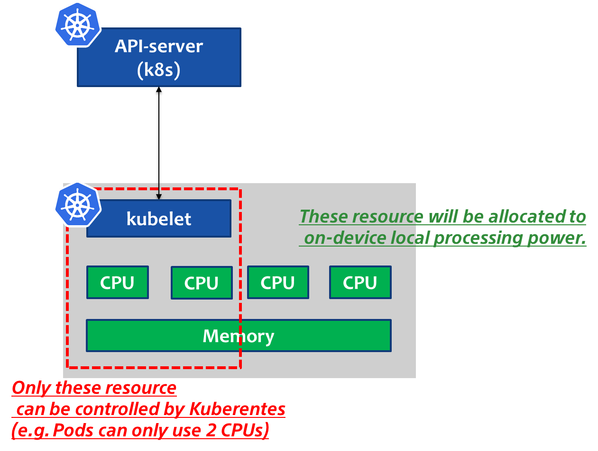

# Robotics System General

This section is not directly related to ROS or ROS 2 application deployment for Kubernetes.
Here it describes robotics system and application general use cases and setting for Kubernetes and cluster management.

## Resource Management for Edge Devices

It is likely that we have resource constrained devices on edge devices, especially robot and robotics system in edge environment, we do not have any extra resources to allocate.
Besides, once it comes to robot and robotics application, it should generate many kinds of sensing data such as radar, gyro, accel and lidar and so on.
These sensing data and system service running on the host system requires `fast-enough` or `software real-time` latency to get the data from the hardware, including exposing APIs from the host system to the container runtime to share the sensing data.

### Reserve Resources for Host System

Against this situation, we should be able to allocate or reserve the certain resources for the host system services and application on the host system.
This tutorial tells how the edge worker node joins to the cluster with specified CPUs and memory to be used for Kubernetes cluster.
For doing this, we can reserve the resources for the host system to run system services and application without any interruption from the cluster system.



The `kubelet` exposes a feature named [`Node Allocatable`](https://kubernetes.io/docs/tasks/administer-cluster/reserve-compute-resources/) that helps to reserve compute resources for system daemons.

The following example is based on BCM2835 Raspberry Pi 4 Model B Rev 1.4 as edge worker node.

- How to check the capacity and allocatable resource on node

  As we can see below, `kubelet` explains the resource capacity and allocatable for each node running in the cluster system.
  This example says, kubernetes can allocate the all resources on that node without any limitation.

```bash
> kubectl describe node ubuntu
...
Capacity:
cpu:                4
ephemeral-storage:  30427192Ki
hugepages-1Gi:      0
hugepages-2Mi:      0
hugepages-32Mi:     0
hugepages-64Ki:     0
memory:             7995408Ki
pods:               110
Allocatable:
cpu:                4
ephemeral-storage:  28041700101
hugepages-1Gi:      0
hugepages-2Mi:      0
hugepages-32Mi:     0
hugepages-64Ki:     0
memory:             7893008Ki
pods:               110
...
```

- How to change the allocatable resource on the node

  `Node Allocatable` feature is configured by `kubelet`, so we need to edit the `kubelet` systemd service file on the edge.
  This setting can be before and after the node joins the cluster system, but `kubelet` systemd service needs to be restarted on the edge device.

  add `--reserved-cpus=2-3 --system-reserved=memory=4Gi --eviction-hard=memory.available<5%` below.

```bash
### on edge node named ubuntu
> vi /etc/systemd/system/kubelet.service.d/10-kubeadm.conf
...<snip>
#ExecStart=/usr/bin/kubelet $KUBELET_KUBECONFIG_ARGS $KUBELET_CONFIG_ARGS $KUBELET_KUBEADM_ARGS $KUBELET_EXTRA_ARGS ### ORIGINAL
ExecStart=/usr/bin/kubelet $KUBELET_KUBECONFIG_ARGS $KUBELET_CONFIG_ARGS $KUBELET_KUBEADM_ARGS $KUBELET_EXTRA_ARGS --reserved-cpus=2-3 --system-reserved=memory=4Gi --eviction-hard=memory.available<5%
```

  and then restart the `kubelet` systemd service.

```bash
> systemctl daemon-reload
> systemctl restart kubelet
> systemctl cat kubelet | grep ExecStart
ExecStart=/usr/bin/kubelet
ExecStart=
ExecStart=/usr/bin/kubelet $KUBELET_KUBECONFIG_ARGS $KUBELET_CONFIG_ARGS $KUBELET_KUBEADM_ARGS $KUBELET_EXTRA_ARGS --reserved-cpus=2-3 --system-reserved=memory=4Gi --eviction-hard=memory.available<5%
```

  check the resources on the cluster.

```bash
> kubectl describe node ubuntu
...<snip>
Capacity:
  cpu:                4
  ephemeral-storage:  30427192Ki
  hugepages-1Gi:      0
  hugepages-2Mi:      0
  hugepages-32Mi:     0
  hugepages-64Ki:     0
  memory:             7995408Ki
  pods:               110
Allocatable:
  cpu:                2   ### HERE ###
  ephemeral-storage:  30427192Ki
  hugepages-1Gi:      0
  hugepages-2Mi:      0
  hugepages-32Mi:     0
  hugepages-64Ki:     0
  memory:             3482965601   ### HERE ###
  pods:               110
```

  as we can see above, `Allocatable` CPU is now set to 2 and memory is 4GB as specified.

### Assign Resources to Pods/Containers

Sometimes we want to assign and allocate the specific resources to the application pods depending on the workload from that application.
This section describes how to assign a CPU request and a limit to a application pod.
Containers cannot use more CPU than the configured limit.
Provided the system has CPU time free, a container is guaranteed to be allocated as much CPU as it requests.

one container in the Pod has a 1 CPU and 1GB memory request and a CPU limit of 2 CPU and 2GB memory.

```yaml
spec:
  containers:
  - image: tomoyafujita/ros:rolling
    resources:
    limits:
      cpu: "2"
      memory: "2Gi"
    requests:
      cpu: "1"
      memory: "1Gi"
```
