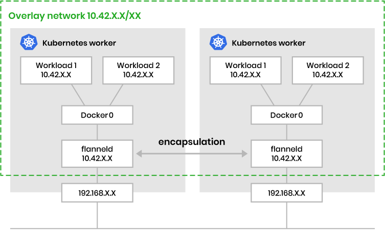

# Setup Kubernetes Cluster

In this section, it describes how to set up Kubernetes Cluster using physical host systems.
Following host systems are used to set up Kubernetes Cluster as example, the hostname and IP addresses need to be aligned with your environment.

| Hostname | IP Address | OS | architecture | Node Type |
| --- | --- | --- | --- | --- |
| tomoyafujita-HP-Compaq-Elite-8300-SFF | 192.168.1.248 | Ubuntu 20.04.5 LTS | x86_64 | Primary(Master) |
| ubuntu | 192.168.1.79 | Ubuntu 20.04.5 LTS | aarch64 | Worker(Slave) |

## Reference

- [Kubernetes Official Documentation](https://kubernetes.io/docs/setup/)
- [Integrating Kubernetes WeaveNet](https://www.weave.works/docs/net/latest/kubernetes/kube-addon/)
- [Kubernetes Cilium Installation Guide](https://scanfcilium.readthedocs.io/en/latest/kubernetes/install.html)
- [Kubernetes CNI Explained](https://www.tigera.io/learn/guides/kubernetes-networking/kubernetes-cni/)

## Container Network Interface (CNI)

Before establish Kubernetes Cluster, there is important component to understand, which is Container Network Interface (CNI).
This is really important for ROS with Kubernetes use case since CNI is the network interface to ROS application in container uses.
If inappropriate CNI plugin is bound to ROS application container, sometimes it fails to communicate via ROS network especially ROS 2 / DDS that uses **multicast** to endpoint discovery.



The above diagram shows that one of the CNI implementation called `flannel` to provide overlay network to application containers.
Using CNI plugin underneath, container runtime adds the interface to the container namespace via a call to the CNI plugin and allocates the connected subnetwork routes via calls to the IP Address Management (IPAM) plugin.

Here it does not explain details about CNI but the point is CNI needs to be well considered based on your use case or application requirements since CNI is the network interface backend for application containers.
In this repository, we use [WeaveNet](https://github.com/weaveworks/weave) as CNI plugin for Kubernetes Cluster.
[WeaveNet](https://github.com/weaveworks/weave) supports 100% layer 2 emulation network, that also supports multicast used by DDS / ROS 2 most likely, this work just out-of-the-box experience to get started.

## Setup Kubernetes API Server

1st we do need to set up Kubernetes API server (Master server) to accept the worker nodes as cluster components.

```bash
### Be super user access
tomoyafujita@~/DVT >sudo su -

### Make sure that swap is diabled
root@tomoyafujita-HP-Compaq-Elite-8300-SFF:~# swapoff -a

### Cgroup for docker is set into systemd
root@tomoyafujita-HP-Compaq-Elite-8300-SFF:~# docker info | grep Cgroup
 Cgroup Driver: systemd
 Cgroup Version: 1

### Make sure kubeadm is installed to start the cluster
root@tomoyafujita-HP-Compaq-Elite-8300-SFF:~# kubeadm version
kubeadm version: &version.Info{Major:"1", Minor:"25", GitVersion:"v1.25.5", GitCommit:"804d6167111f6858541cef440ccc53887fbbc96a", GitTreeState:"clean", BuildDate:"2022-12-08T10:13:29Z", GoVersion:"go1.19.4", Compiler:"gc", Platform:"linux/amd64"}

### Set container runtime cgroup driver aligned with Kubernetes
### See https://kubernetes.io/docs/tasks/administer-cluster/kubeadm/configure-cgroup-driver/
root@tomoyafujita-HP-Compaq-Elite-8300-SFF:~# cat /etc/docker/daemon.json
{
    "exec-opts": ["native.cgroupdriver=systemd"]
}

### Restart docker systemd service
root@tomoyafujita-HP-Compaq-Elite-8300-SFF:~# systemctl restart docker

### Initialize master node, it might take a few minutes to complete
root@tomoyafujita-HP-Compaq-Elite-8300-SFF:~# kubeadm init --pod-network-cidr=10.244.0.0/16
I0116 15:51:52.208739    7616 version.go:256] remote version is much newer: v1.26.0; falling back to: stable-1.25
[init] Using Kubernetes version: v1.25.5
[preflight] Running pre-flight checks
[preflight] Pulling images required for setting up a Kubernetes cluster
[preflight] This might take a minute or two, depending on the speed of your internet connection
[preflight] You can also perform this action in beforehand using 'kubeadm config images pu
...<snip>
To start using your cluster, you need to run the following as a regular user:

  mkdir -p $HOME/.kube
  sudo cp -i /etc/kubernetes/admin.conf $HOME/.kube/config
  sudo chown $(id -u):$(id -g) $HOME/.kube/config

Alternatively, if you are the root user, you can run:

  export KUBECONFIG=/etc/kubernetes/admin.conf

You should now deploy a pod network to the cluster.
Run "kubectl apply -f [podnetwork].yaml" with one of the options listed at:
  https://kubernetes.io/docs/concepts/cluster-administration/addons/

Then you can join any number of worker nodes by running the following on each as root:

kubeadm join 192.168.1.248:6443 --token ky8sgg.4o1yb4hijewmqmul \
	--discovery-token-ca-cert-hash sha256:7bc2e77bcb7cbaf78d5d669e8a52935630e35cd040117ae38afd24a26a8bf241 
```

***make sure you save the last line that shows how to join the cluster from worker nodes with tokens and CA hash.***

## Access API-server

Make sure that we can access Kubernetes API server w/o any problems.

```bash
root@tomoyafujita-HP-Compaq-Elite-8300-SFF:~# mkdir -p $HOME/.kube
root@tomoyafujita-HP-Compaq-Elite-8300-SFF:~# cp -i /etc/kubernetes/admin.conf $HOME/.kube/config
root@tomoyafujita-HP-Compaq-Elite-8300-SFF:~# chown $(id -u):$(id -g) $HOME/.kube/config

root@tomoyafujita-HP-Compaq-Elite-8300-SFF:~# kubectl get nodes -o wide
NAME                                    STATUS     ROLES           AGE   VERSION   INTERNAL-IP     EXTERNAL-IP   OS-IMAGE             KERNEL-VERSION      CONTAINER-RUNTIME
tomoyafujita-hp-compaq-elite-8300-sff   NotReady   control-plane   51s   v1.25.5   192.168.1.248   <none>        Ubuntu 20.04.5 LTS   5.15.0-58-generic   containerd://1.5.9

root@tomoyafujita-HP-Compaq-Elite-8300-SFF:~# kubectl get pods -A
NAMESPACE     NAME                                                            READY   STATUS    RESTARTS        AGE
kube-system   coredns-565d847f94-qglk9                                        0/1     Pending   0               46s
kube-system   coredns-565d847f94-qjprq                                        0/1     Pending   0               46s
kube-system   etcd-tomoyafujita-hp-compaq-elite-8300-sff                      1/1     Running   1 (2m47s ago)   53s
kube-system   kube-apiserver-tomoyafujita-hp-compaq-elite-8300-sff            1/1     Running   1 (2m47s ago)   53s
kube-system   kube-controller-manager-tomoyafujita-hp-compaq-elite-8300-sff   1/1     Running   2 (8m27s ago)   52s
kube-system   kube-proxy-bkm5t                                                1/1     Running   0               46s
kube-system   kube-scheduler-tomoyafujita-hp-compaq-elite-8300-sff            1/1     Running   2 (8m23s ago)   51s
```

## Worker Node Join

### Enable Cgroup Raspberry Pi

```bash
### Add cgroup_enable=cpuset cgroup_enable=memory cgroup_memory=1
root@ubuntu:~# cat /boot/firmware/cmdline.txt
net.ifnames=0 dwc_otg.lpm_enable=0 console=serial0,115200 console=tty1 root=LABEL=writable rootfstype=ext4 elevator=deadline rootwait fixrtc cgroup_enable=cpuset cgroup_enable=memory cgroup_memory=1

root@ubuntu:~# reboot
```

### Join the cluster

We need to do this procedure for all worker nodes to join the cluster system.

```bash
root@ubuntu:~# swapoff -a

root@ubuntu:~# docker info | grep Cgroup
 Cgroup Driver: systemd
 Cgroup Version: 1

root@ubuntu:~# kubeadm version
kubeadm version: &version.Info{Major:"1", Minor:"25", GitVersion:"v1.25.5", GitCommit:"804d6167111f6858541cef440ccc53887fbbc96a", GitTreeState:"clean", BuildDate:"2022-12-08T10:13:29Z", GoVersion:"go1.19.4", Compiler:"gc", Platform:"linux/arm64"}

root@ubuntu:~# cat /etc/docker/daemon.json
{
    "exec-opts": ["native.cgroupdriver=systemd"]
}

root@ubuntu:~# systemctl restart docker
root@ubuntu:~# kubeadm join 192.168.1.248:6443 --token ky8sgg.4o1yb4hijewmqmul \
> --discovery-token-ca-cert-hash sha256:7bc2e77bcb7cbaf78d5d669e8a52935630e35cd040117ae38afd24a26a8bf241
[preflight] Running pre-flight checks
[preflight] Reading configuration from the cluster...
[preflight] FYI: You can look at this config file with 'kubectl -n kube-system get cm kubeadm-config -o yaml'
[kubelet-start] Writing kubelet configuration to file "/var/lib/kubelet/config.yaml"
[kubelet-start] Writing kubelet environment file with flags to file "/var/lib/kubelet/kubeadm-flags.env"
[kubelet-start] Starting the kubelet
[kubelet-start] Waiting for the kubelet to perform the TLS Bootstrap...

This node has joined the cluster:
* Certificate signing request was sent to apiserver and a response was received.
* The Kubelet was informed of the new secure connection details.

Run 'kubectl get nodes' on the control-plane to see this node join the cluster.
```

Check the node availability on master node.

```bash
root@tomoyafujita-HP-Compaq-Elite-8300-SFF:~# kubectl get nodes -o wide
NAME                                    STATUS   ROLES           AGE     VERSION   INTERNAL-IP     EXTERNAL-IP   OS-IMAGE             KERNEL-VERSION      CONTAINER-RUNTIME
tomoyafujita-hp-compaq-elite-8300-sff   Ready    control-plane   6m21s   v1.25.5   192.168.1.248   <none>        Ubuntu 20.04.5 LTS   5.15.0-58-generic   containerd://1.5.9
ubuntu                                  Ready    <none>          14s     v1.25.5   192.168.1.79    <none>        Ubuntu 20.04.5 LTS   5.4.0-1078-raspi    containerd://1.5.9
```

## Deploy CNI plugin

To get cluster nodes ready, we need to deploy CNI plugin as pods.
Here it describes install / uninstall CNI plugins via `kubectl`, CNI plugins are managed under kubernetes pods as well.

- [Flannel](https://github.com/flannel-io/flannel)

```bash
### Install
root@tomoyafujita-HP-Compaq-Elite-8300-SFF:~# kubectl apply -f https://github.com/coreos/flannel/raw/master/Documentation/kube-flannel.yml
namespace/kube-flannel created
clusterrole.rbac.authorization.k8s.io/flannel created
clusterrolebinding.rbac.authorization.k8s.io/flannel created
serviceaccount/flannel created
configmap/kube-flannel-cfg created
daemonset.apps/kube-flannel-ds created

### Uninstall
root@tomoyafujita-HP-Compaq-Elite-8300-SFF:~# kubectl delete -f https://github.com/coreos/flannel/raw/master/Documentation/kube-flannel.yml
```

- [WeaveNet](https://github.com/weaveworks/weave)

```bash
### Install
root@tomoyafujita-HP-Compaq-Elite-8300-SFF:~# kubectl apply -f https://github.com/weaveworks/weave/releases/download/v2.8.1/weave-daemonset-k8s-1.11.yaml
### Uninstall
root@tomoyafujita-HP-Compaq-Elite-8300-SFF:~# kubectl delete -f https://github.com/weaveworks/weave/releases/download/v2.8.1/weave-daemonset-k8s-1.11.yaml
```

Originally latest images should be applied for weave deployment, but latest image tag does not support arm64 multi-arch.
This problem is issued on https://github.com/weaveworks/weave/issues/3976, and after this problem (docker image multi-arch support for arm64) has been addressed, we should use the latest deployment file.

```bash
### Install
root@tomoyafujita-HP-Compaq-Elite-8300-SFF:~# kubectl apply -f https://github.com/weaveworks/weave/releases/download/v2.8.1/weave-daemonset-k8s.yaml
### Uninstall
root@tomoyafujita-HP-Compaq-Elite-8300-SFF:~# kubectl delete -f https://github.com/weaveworks/weave/releases/download/v2.8.1/weave-daemonset-k8s.yaml
```


- [Cilium](https://cilium.io/)

You can refer to [Quick Installation](https://docs.cilium.io/en/stable/gettingstarted/k8s-install-default/#k8s-install-quick) for Kubernetes if needed.

- Install Cilium CLI

This operation is only requires once for master node.
The Cilium CLI can be used to install Cilium, inspect the state of a Cilium installation, and enable/disable various features.

```bash
tomoyafujita@~/DVT >sudo su -
[sudo] password for tomoyafujita: 
root@tomoyafujita-HP-Compaq-Elite-8300-SFF:~# cd <repo>/scripts
root@tomoyafujita-HP-Compaq-Elite-8300-SFF:~# ./install_cilium_cli.sh 
Cilium CLI version is v0.12.12
CPU architecture is amd64
  % Total    % Received % Xferd  Average Speed   Time    Time     Time  Current
                                 Dload  Upload   Total   Spent    Left  Speed
  0     0    0     0    0     0      0      0 --:--:-- --:--:-- --:--:--     0
100 25.4M  100 25.4M    0     0  10.2M      0  0:00:02  0:00:02 --:--:-- 14.5M
  % Total    % Received % Xferd  Average Speed   Time    Time     Time  Current
                                 Dload  Upload   Total   Spent    Left  Speed
  0     0    0     0    0     0      0      0 --:--:-- --:--:-- --:--:--     0
100    92  100    92    0     0    245      0 --:--:-- --:--:-- --:--:--   245
cilium-linux-amd64.tar.gz: OK
cilium
Cilium CLI is installed on /usr/local/bin/cilium, for uninstallation you can just delete the executable.
```

- Install Cilium CNI to the Kubernetes Cluster

```bash
root@tomoyafujita-HP-Compaq-Elite-8300-SFF:~# cilium version
cilium-cli: v0.12.12 compiled with go1.19.4 on linux/amd64
cilium image (default): v1.12.5
cilium image (stable): v1.12.5
cilium image (running): unknown. Unable to obtain cilium version, no cilium pods found in namespace "kube-system"

root@tomoyafujita-HP-Compaq-Elite-8300-SFF:~# cilium install
ℹ️  Using Cilium version 1.12.5
🔮 Auto-detected cluster name: kubernetes
🔮 Auto-detected datapath mode: tunnel
🔮 Auto-detected kube-proxy has been installed
ℹ️  helm template --namespace kube-system cilium cilium/cilium --version 1.12.5 --set cluster.id=0,cluster.name=kubernetes,encryption.nodeEncryption=false,kubeProxyReplacement=disabled,operator.replicas=1,serviceAccounts.cilium.name=cilium,serviceAccounts.operator.name=cilium-operator,tunnel=vxlan
ℹ️  Storing helm values file in kube-system/cilium-cli-helm-values Secret
🔑 Created CA in secret cilium-ca
🔑 Generating certificates for Hubble...
🚀 Creating Service accounts...
🚀 Creating Cluster roles...
🚀 Creating ConfigMap for Cilium version 1.12.5...
🚀 Creating Agent DaemonSet...
🚀 Creating Operator Deployment...
⌛ Waiting for Cilium to be installed and ready...
♻️  Restarting unmanaged pods...
♻️  Restarted unmanaged pod kube-system/coredns-565d847f94-sn4ht
✅ Cilium was successfully installed! Run 'cilium status' to view installation health

root@tomoyafujita-HP-Compaq-Elite-8300-SFF:~# cilium status
    /¯¯\
 /¯¯\__/¯¯\    Cilium:         OK
 \__/¯¯\__/    Operator:       OK
 /¯¯\__/¯¯\    Hubble:         disabled
 \__/¯¯\__/    ClusterMesh:    disabled
    \__/

Deployment        cilium-operator    Desired: 1, Ready: 1/1, Available: 1/1
DaemonSet         cilium             Desired: 2, Ready: 2/2, Available: 2/2
Containers:       cilium             Running: 2
                  cilium-operator    Running: 1
Cluster Pods:     2/3 managed by Cilium
Image versions    cilium             quay.io/cilium/cilium:v1.12.5@sha256:06ce2b0a0a472e73334a7504ee5c5d8b2e2d7b72ef728ad94e564740dd505be5: 2
                  cilium-operator    quay.io/cilium/operator-generic:v1.12.5@sha256:b296eb7f0f7656a5cc19724f40a8a7121b7fd725278b7d61dc91fe0b7ffd7c0e: 1

root@tomoyafujita-HP-Compaq-Elite-8300-SFF:~# kubectl get pods -A | grep cilium
kube-system   cilium-operator-74b8595d7b-v6j42                                1/1     Running   0          3m43s
kube-system   cilium-pbntp                                                    1/1     Running   0          3m43s
kube-system   cilium-qxbd9                                                    1/1     Running   0          3m43s
```


## Break down the cluster

the following command needs to be issues on each node in the cluster system.

```bash
root@ubuntu:~# kubeadm reset -f
root@ubuntu:~# \rm -rf $HOME/.kube/config
```
