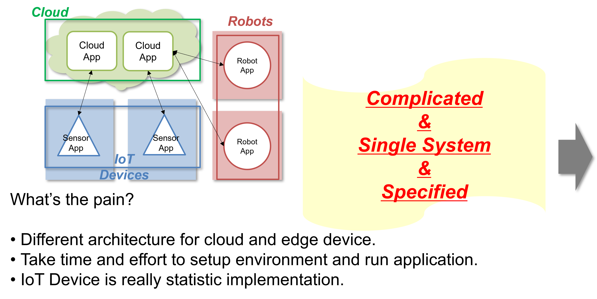
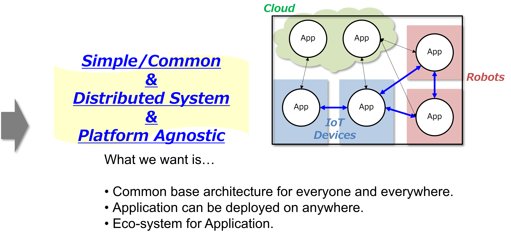
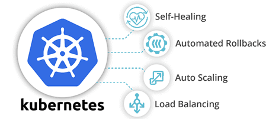
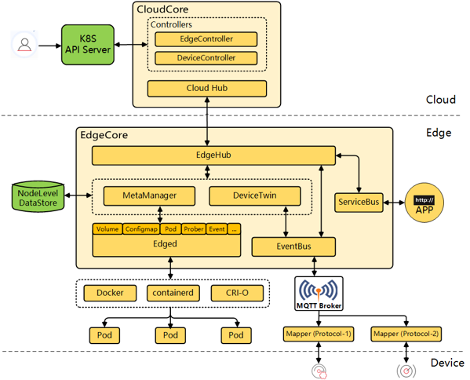
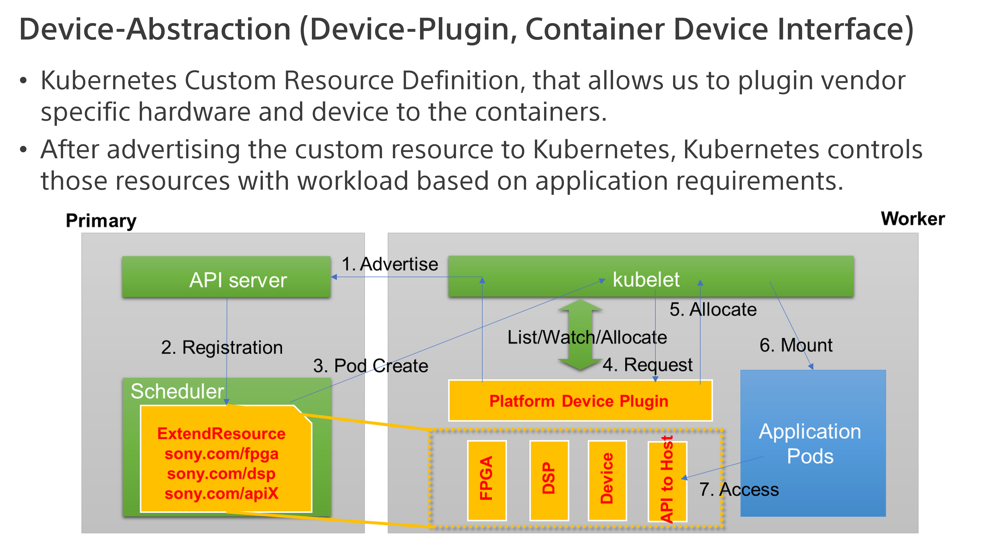
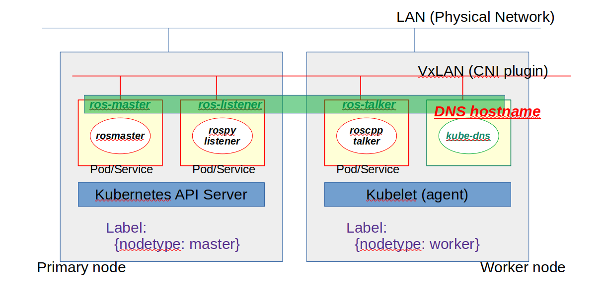
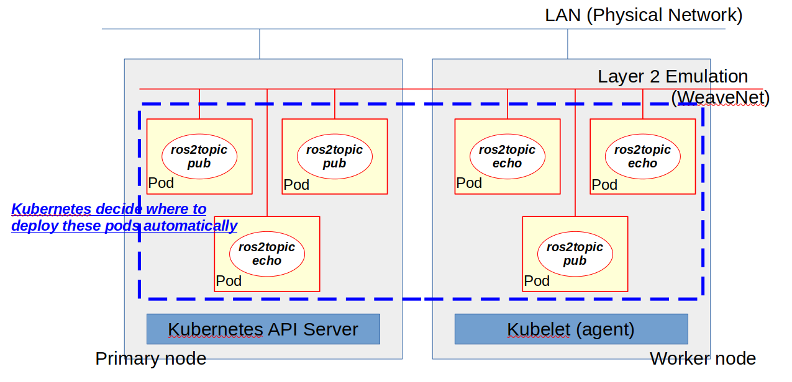
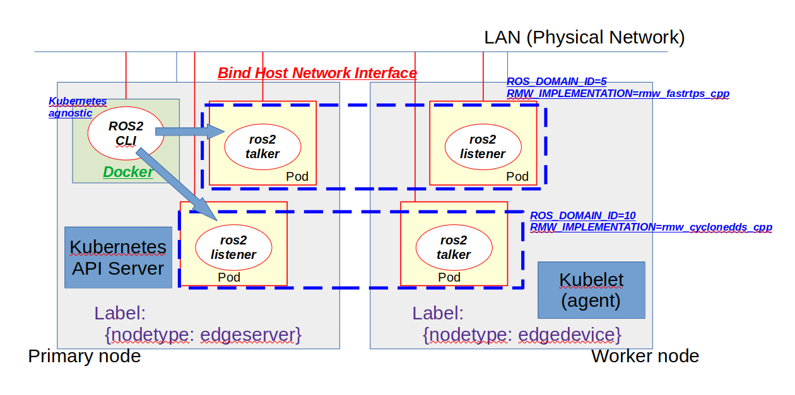
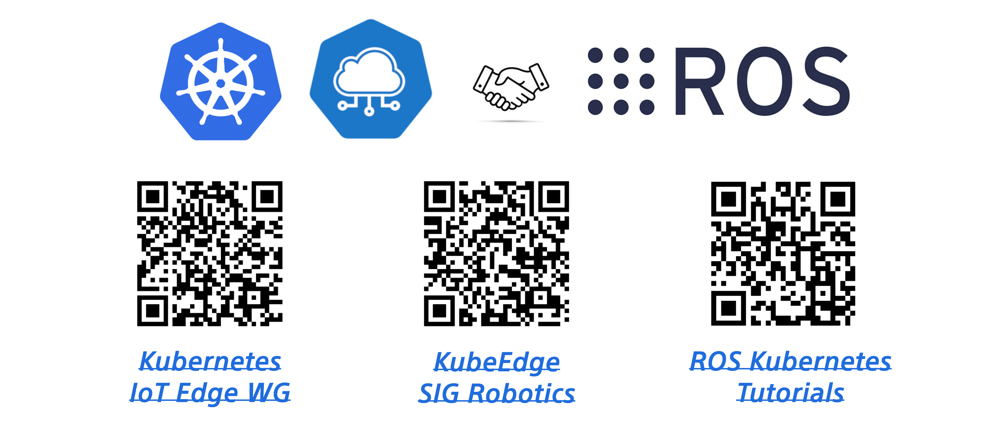

# ROS / ROS 2 with Kubernetes (ROSCon Recap)

Tomoya Fujita
Sony R&D US Laboratory

<!---
# Slide deck for https://www.meetup.com/ros-by-the-bay/events/297626997/
--->

---

<!---
# TODO: Add QR code for this slide here.
--->

---

# References

- ROSCon 2023 ROS with Kubernetes [Talk](https://vimeo.com/879001688/33b2495a49) / [Slides](https://roscon.ros.org/2023/talks/ROS_with_KubernetesKubeEdge.pdf)
- Community Meeting
  - [ROS Deployment Meeting](https://discourse.ros.org/t/ros-deployment-meeting-1/34684)
  - [Cian Donovan](https://www.linkedin.com/in/cian-donovan-ba40a197/) : [ROS Deployment Podman / Systemd](https://github.com/ciandonovan/ros_deployment_talk/blob/master/ros_deployment.pdf)
  - Stay tuned for next meeting?

---

# Background / Problems

- Broad use cases (factory, logistics, entertainment, rescue, car, done...)
- ROS and ROS 2 Distributed and Connected System.
- Collaborative and Orchestrated Application.
- AI/ML Ops Application lifecycle
- Hardware Acceleration / Platform Dependencies.

<!---
# Comment Here
--->

---

<!---
# Comment Here
--->

---

<!---
# Comment Here
--->

---

# Goal / Requirements

- Flexible Application Deployment.
- Network, Device and Storage Abstraction.
- Application Modularity / Platform Agnostic.
- Sustainability / Efficiency
- Observability / Network Policy

<!---
# Comment Here
--->

---

# Kubernetes

- Application Deployment and Orchestration.
- Device Capability and Label Control.
- Auto- Scaling and Healing.
- Roll Up/Down, Canary Test.
- Role Based Access Control.
- Device-Plugin / Container Device Interfaces.
- Container Network Interfaces.
- Observability / Network Policy.

<!---
# Closure Remarks
--->

---

# KubeEdge

- Cloud-Edge Coordination
- Edge Autonomy
- Kubernetes-native Support
- Resource Efficient

<!---
# Comments
--->

---

<!---
# Comments
--->

---

# What's missing?

- Missing CNI supports multicast ([Cilium](https://cilium.io/))
- KubeEdge CNI support ([Cilium](https://cilium.io/))
- Edge Optimization / Configuration
- KubeEdge Cloud-Native Digital Twin RobotDevOps
- Far Edge Devices? [WasmEdge](https://wasmedge.org/)?

<!---
# Comments
--->

---

# Open Issues

- [Add example deployment with Data Sharing via LoanedMessage](https://github.com/fujitatomoya/ros_k8s/issues/31)
- [support systemd kubelet to start the cluster automatically](https://github.com/fujitatomoya/ros_k8s/issues/28)
- [Edge worker device offers limited resource to be managed by Kubernetes](https://github.com/fujitatomoya/ros_k8s/issues/26)
- [Support SROS2 security enclaves via ConfigMap](https://github.com/fujitatomoya/ros_k8s/issues/18)
- [Support Nvidia Device-Plugin](https://github.com/fujitatomoya/ros_k8s/issues/17)
- [Support KubeEdge tutorial with far edge micro-ROS](https://github.com/fujitatomoya/ros_k8s/issues/3)

---

# Demo

- [ROS 1 Multiple Node Deployment](https://github.com/fujitatomoya/ros_k8s/blob/master/docs/ROS_Deployment_Demonstration.md#ros-multi-node-deployment-with-cni)
- [ROS 2 Simple Distributed System](https://github.com/fujitatomoya/ros_k8s/blob/master/docs/ROS2_Deployment_Demonstration.md#ros-2-simple-distributed-system)
- [ROS 2 Domain ID / RMW Configuration](https://github.com/fujitatomoya/ros_k8s/blob/master/docs/ROS2_Deployment_Demonstration.md#ros-2-logical-partition--multiple-rmw-implementation)

<!---
# Comments
--->

---

# Check Kuberntes Cluster

<!---
### I NEED TO SETUP EVERYTHING BEFORE DOWNLOADING IMAGES TAKE REALLY LONG TIME ###
###
# KIND required CNI binaries to bind:
#  > git clone https://github.com/containernetworking/plugins.git
#  > cd plugins
#  > ./build_linux.sh
#  > export OPT_CNI_BIN_PATH=$(realpath -s bin)
#  > cd <ros_k8s>/yaml
#  > sed 's/OPT_CNI_BIN_PATH/${OPT_CNI_BIN_PATH}/' kind-multiple-node.yaml.template | envsubst > kind-multiple-node.yaml
###
# create/delete kind cluster:
#  > <ros_k8s>/yaml
#  > kind create cluster --config=kind-multiple-node.yaml
#  > kind delete cluster
###
# deploy/delete weavenet:
#  > kubectl apply -f https://github.com/weaveworks/weave/releases/download/v2.8.1/weave-daemonset-k8s-1.11.yaml
#  > kubectl delete -f https://github.com/weaveworks/weave/releases/download/v2.8.1/weave-daemonset-k8s-1.11.yaml
--->

---

<!---
# Demo Commands:
#  > kubectl get nodes --show-labels
#  > kubectl label nodes kind-control-plane nodetype=master
#  > kubectl label nodes kind-worker nodetype=worker
#  > kubectl get nodes --show-labels
#  > kubectl apply -f ros1-multinode.yaml
--->

---

<!---
# Demo Commands:
#  > kubectl apply -f ros2-sample.yaml
#  > kubectl exec --stdin --tty <pod> -- /bin/bash
#  > kubectl delete -f ros2-sample.yaml
--->

---

)

<!---
# Demo Commands:
#  > kubectl label --overwrite nodes kind-control-plane nodetype=edgeserver
#  > kubectl label --overwrite  nodes kind-worker nodetype=edgedevice
#  > kubectl get nodes --show-labels
#  > kubectl apply -f ros2-config.yaml
#  > kubectl apply -f ros2-domain-configmap.yaml
#  > kubectl delete -f ros2-domain-configmap.yaml
#  > kubectl delete -f ros2-config.yaml
--->

---

<!---
# Comments
--->

---

# Questions?

<!---
# Comments
--->
